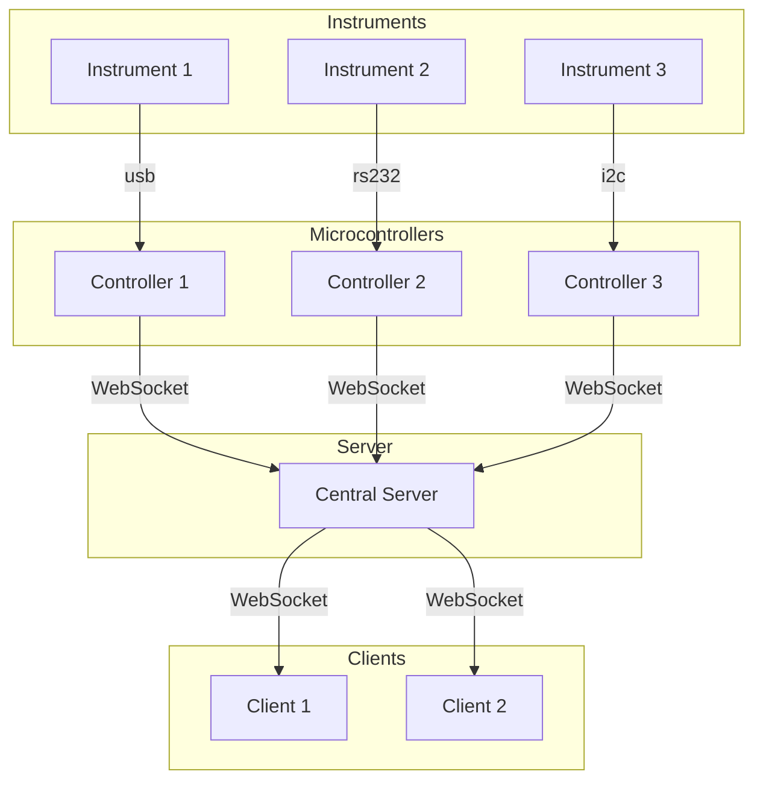
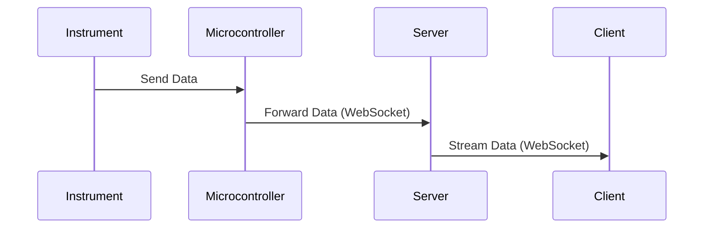
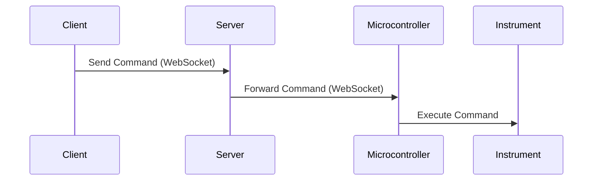

# Kleinmaelzung

## System Overview
This project facilitates real-time communication between scientific microcontrollers (e.g., Raspberry Pis that are connected to instruments via serial interface), a central server, and client applications, using WebSocket protocols for seamless, bidirectional data transfer. The system architecture is designed to allow clients to monitor and control instruments remotely through the server, making it ideal for scientific applications that require continuous data streaming and interactive control.

## System Flow
### 1. Instrument-to-Microcontroller Connection:

Each scientific instrument is connected to a microcontroller (e.g. a Raspberry Pi) via an appropriate communication interface (e.g. serial (usb, rs232)).
The microcontroller is responsible for collecting data from the instrument and forwarding it to the central server.

### 2. Microcontroller-to-Server Communication:

The microcontroller establishes a persistent WebSocket connection to the server.
This WebSocket connection allows the microcontroller to continuously send data from the instrument to the server in real-time.
It also enables the server to send control commands back to the microcontroller, which are then relayed to the instrument.

### 3. Server as a Central Hub:

The server acts as a central hub for all data traffic, managing WebSocket connections from both microcontrollers and clients.
When an instrument sends data via the microcontroller, the server immediately forwards this data to any connected client that is subscribed to that instrument’s data stream.

### 4. Client-to-Server Communication:

Clients can connect to the server over WebSocket to listen to live data from specific instruments.
Clients can select which instruments they want to monitor, and the server will route relevant data from those instruments to the client in real-time.
The WebSocket protocol also enables clients to send commands to instruments via the server, providing two-way communication for control and configuration purposes.

### Key Features
Bi-directional Communication: WebSocket connections enable both data monitoring and command sending, making the system highly interactive.
Centralized Management: The server coordinates data flow between multiple instruments, microcontrollers, and clients.
Scalability: Additional instruments and clients can be added as needed, making the system flexible for larger deployments.

## Diagrams showing overall system flow
This diagram outlines the main components and their connections in the system.

2. Data Flow Diagram
This diagram illustrates how data flows through the system from instruments to clients, with the server as the intermediary.

3. Command Flow Diagram
This shows how commands from a client can be sent back to the instruments through the server and microcontroller.

### Additional features:
1. Data Traffic Logging:

    - The server includes a logging feature that records all incoming and outgoing data traffic between the instruments, microcontrollers, and clients.
    - This feature allows for tracking of data transmission history, which can be useful for diagnostics, troubleshooting, and historical data analysis.

2. Calibration Protocol Generation:

    - The server can create calibration protocols for instruments, allowing users to standardize and document calibration processes.
    - The protocol can be downloaded as a PDF, making it easy to print or share for compliance and record-keeping purposes.

<mxGraphModel dx="954" dy="674" grid="1" gridSize="10" guides="1" tooltips="1" connect="1" arrows="1" fold="1" page="1" pageScale="1" pageWidth="827" pageHeight="1169" math="0" shadow="0">
  <root>
    <mxCell id="WIyWlLk6GJQsqaUBKTNV-0" />
    <mxCell id="WIyWlLk6GJQsqaUBKTNV-1" parent="WIyWlLk6GJQsqaUBKTNV-0" />
    <mxCell id="zkfFHV4jXpPFQw0GAbJ--0" value="Person" style="swimlane;fontStyle=2;align=center;verticalAlign=top;childLayout=stackLayout;horizontal=1;startSize=26;horizontalStack=0;resizeParent=1;resizeLast=0;collapsible=1;marginBottom=0;rounded=0;shadow=0;strokeWidth=1;" parent="WIyWlLk6GJQsqaUBKTNV-1" vertex="1">
      <mxGeometry x="220" y="120" width="160" height="138" as="geometry">
        <mxRectangle x="230" y="140" width="160" height="26" as="alternateBounds" />
      </mxGeometry>
    </mxCell>
    <mxCell id="zkfFHV4jXpPFQw0GAbJ--1" value="Name" style="text;align=left;verticalAlign=top;spacingLeft=4;spacingRight=4;overflow=hidden;rotatable=0;points=[[0,0.5],[1,0.5]];portConstraint=eastwest;" parent="zkfFHV4jXpPFQw0GAbJ--0" vertex="1">
      <mxGeometry y="26" width="160" height="26" as="geometry" />
    </mxCell>
    <mxCell id="zkfFHV4jXpPFQw0GAbJ--2" value="Phone Number" style="text;align=left;verticalAlign=top;spacingLeft=4;spacingRight=4;overflow=hidden;rotatable=0;points=[[0,0.5],[1,0.5]];portConstraint=eastwest;rounded=0;shadow=0;html=0;" parent="zkfFHV4jXpPFQw0GAbJ--0" vertex="1">
      <mxGeometry y="52" width="160" height="26" as="geometry" />
    </mxCell>
    <mxCell id="zkfFHV4jXpPFQw0GAbJ--3" value="Email Address" style="text;align=left;verticalAlign=top;spacingLeft=4;spacingRight=4;overflow=hidden;rotatable=0;points=[[0,0.5],[1,0.5]];portConstraint=eastwest;rounded=0;shadow=0;html=0;" parent="zkfFHV4jXpPFQw0GAbJ--0" vertex="1">
      <mxGeometry y="78" width="160" height="26" as="geometry" />
    </mxCell>
    <mxCell id="zkfFHV4jXpPFQw0GAbJ--4" value="" style="line;html=1;strokeWidth=1;align=left;verticalAlign=middle;spacingTop=-1;spacingLeft=3;spacingRight=3;rotatable=0;labelPosition=right;points=[];portConstraint=eastwest;" parent="zkfFHV4jXpPFQw0GAbJ--0" vertex="1">
      <mxGeometry y="104" width="160" height="8" as="geometry" />
    </mxCell>
    <mxCell id="zkfFHV4jXpPFQw0GAbJ--5" value="Purchase Parking Pass" style="text;align=left;verticalAlign=top;spacingLeft=4;spacingRight=4;overflow=hidden;rotatable=0;points=[[0,0.5],[1,0.5]];portConstraint=eastwest;" parent="zkfFHV4jXpPFQw0GAbJ--0" vertex="1">
      <mxGeometry y="112" width="160" height="26" as="geometry" />
    </mxCell>
    <mxCell id="zkfFHV4jXpPFQw0GAbJ--6" value="Student" style="swimlane;fontStyle=0;align=center;verticalAlign=top;childLayout=stackLayout;horizontal=1;startSize=26;horizontalStack=0;resizeParent=1;resizeLast=0;collapsible=1;marginBottom=0;rounded=0;shadow=0;strokeWidth=1;" parent="WIyWlLk6GJQsqaUBKTNV-1" vertex="1">
      <mxGeometry x="120" y="360" width="160" height="138" as="geometry">
        <mxRectangle x="130" y="380" width="160" height="26" as="alternateBounds" />
      </mxGeometry>
    </mxCell>
    <mxCell id="zkfFHV4jXpPFQw0GAbJ--7" value="Student Number" style="text;align=left;verticalAlign=top;spacingLeft=4;spacingRight=4;overflow=hidden;rotatable=0;points=[[0,0.5],[1,0.5]];portConstraint=eastwest;" parent="zkfFHV4jXpPFQw0GAbJ--6" vertex="1">
      <mxGeometry y="26" width="160" height="26" as="geometry" />
    </mxCell>
    <mxCell id="zkfFHV4jXpPFQw0GAbJ--8" value="Average Mark" style="text;align=left;verticalAlign=top;spacingLeft=4;spacingRight=4;overflow=hidden;rotatable=0;points=[[0,0.5],[1,0.5]];portConstraint=eastwest;rounded=0;shadow=0;html=0;" parent="zkfFHV4jXpPFQw0GAbJ--6" vertex="1">
      <mxGeometry y="52" width="160" height="26" as="geometry" />
    </mxCell>
    <mxCell id="zkfFHV4jXpPFQw0GAbJ--9" value="" style="line;html=1;strokeWidth=1;align=left;verticalAlign=middle;spacingTop=-1;spacingLeft=3;spacingRight=3;rotatable=0;labelPosition=right;points=[];portConstraint=eastwest;" parent="zkfFHV4jXpPFQw0GAbJ--6" vertex="1">
      <mxGeometry y="78" width="160" height="8" as="geometry" />
    </mxCell>
    <mxCell id="zkfFHV4jXpPFQw0GAbJ--10" value="Is Eligible To Enroll" style="text;align=left;verticalAlign=top;spacingLeft=4;spacingRight=4;overflow=hidden;rotatable=0;points=[[0,0.5],[1,0.5]];portConstraint=eastwest;fontStyle=4" parent="zkfFHV4jXpPFQw0GAbJ--6" vertex="1">
      <mxGeometry y="86" width="160" height="26" as="geometry" />
    </mxCell>
    <mxCell id="zkfFHV4jXpPFQw0GAbJ--11" value="Get Seminars Taken" style="text;align=left;verticalAlign=top;spacingLeft=4;spacingRight=4;overflow=hidden;rotatable=0;points=[[0,0.5],[1,0.5]];portConstraint=eastwest;" parent="zkfFHV4jXpPFQw0GAbJ--6" vertex="1">
      <mxGeometry y="112" width="160" height="26" as="geometry" />
    </mxCell>
    <mxCell id="zkfFHV4jXpPFQw0GAbJ--12" value="" style="endArrow=block;endSize=10;endFill=0;shadow=0;strokeWidth=1;rounded=0;curved=0;edgeStyle=elbowEdgeStyle;elbow=vertical;" parent="WIyWlLk6GJQsqaUBKTNV-1" source="zkfFHV4jXpPFQw0GAbJ--6" target="zkfFHV4jXpPFQw0GAbJ--0" edge="1">
      <mxGeometry width="160" relative="1" as="geometry">
        <mxPoint x="200" y="203" as="sourcePoint" />
        <mxPoint x="200" y="203" as="targetPoint" />
      </mxGeometry>
    </mxCell>
    <mxCell id="zkfFHV4jXpPFQw0GAbJ--13" value="Professor" style="swimlane;fontStyle=0;align=center;verticalAlign=top;childLayout=stackLayout;horizontal=1;startSize=26;horizontalStack=0;resizeParent=1;resizeLast=0;collapsible=1;marginBottom=0;rounded=0;shadow=0;strokeWidth=1;" parent="WIyWlLk6GJQsqaUBKTNV-1" vertex="1">
      <mxGeometry x="330" y="360" width="160" height="70" as="geometry">
        <mxRectangle x="340" y="380" width="170" height="26" as="alternateBounds" />
      </mxGeometry>
    </mxCell>
    <mxCell id="zkfFHV4jXpPFQw0GAbJ--14" value="Salary" style="text;align=left;verticalAlign=top;spacingLeft=4;spacingRight=4;overflow=hidden;rotatable=0;points=[[0,0.5],[1,0.5]];portConstraint=eastwest;" parent="zkfFHV4jXpPFQw0GAbJ--13" vertex="1">
      <mxGeometry y="26" width="160" height="26" as="geometry" />
    </mxCell>
    <mxCell id="zkfFHV4jXpPFQw0GAbJ--15" value="" style="line;html=1;strokeWidth=1;align=left;verticalAlign=middle;spacingTop=-1;spacingLeft=3;spacingRight=3;rotatable=0;labelPosition=right;points=[];portConstraint=eastwest;" parent="zkfFHV4jXpPFQw0GAbJ--13" vertex="1">
      <mxGeometry y="52" width="160" height="8" as="geometry" />
    </mxCell>
    <mxCell id="zkfFHV4jXpPFQw0GAbJ--16" value="" style="endArrow=block;endSize=10;endFill=0;shadow=0;strokeWidth=1;rounded=0;curved=0;edgeStyle=elbowEdgeStyle;elbow=vertical;" parent="WIyWlLk6GJQsqaUBKTNV-1" source="zkfFHV4jXpPFQw0GAbJ--13" target="zkfFHV4jXpPFQw0GAbJ--0" edge="1">
      <mxGeometry width="160" relative="1" as="geometry">
        <mxPoint x="210" y="373" as="sourcePoint" />
        <mxPoint x="310" y="271" as="targetPoint" />
      </mxGeometry>
    </mxCell>
    <mxCell id="zkfFHV4jXpPFQw0GAbJ--17" value="Address" style="swimlane;fontStyle=0;align=center;verticalAlign=top;childLayout=stackLayout;horizontal=1;startSize=26;horizontalStack=0;resizeParent=1;resizeLast=0;collapsible=1;marginBottom=0;rounded=0;shadow=0;strokeWidth=1;" parent="WIyWlLk6GJQsqaUBKTNV-1" vertex="1">
      <mxGeometry x="508" y="120" width="160" height="216" as="geometry">
        <mxRectangle x="550" y="140" width="160" height="26" as="alternateBounds" />
      </mxGeometry>
    </mxCell>
    <mxCell id="zkfFHV4jXpPFQw0GAbJ--18" value="Street" style="text;align=left;verticalAlign=top;spacingLeft=4;spacingRight=4;overflow=hidden;rotatable=0;points=[[0,0.5],[1,0.5]];portConstraint=eastwest;" parent="zkfFHV4jXpPFQw0GAbJ--17" vertex="1">
      <mxGeometry y="26" width="160" height="26" as="geometry" />
    </mxCell>
    <mxCell id="zkfFHV4jXpPFQw0GAbJ--19" value="City" style="text;align=left;verticalAlign=top;spacingLeft=4;spacingRight=4;overflow=hidden;rotatable=0;points=[[0,0.5],[1,0.5]];portConstraint=eastwest;rounded=0;shadow=0;html=0;" parent="zkfFHV4jXpPFQw0GAbJ--17" vertex="1">
      <mxGeometry y="52" width="160" height="26" as="geometry" />
    </mxCell>
    <mxCell id="zkfFHV4jXpPFQw0GAbJ--20" value="State" style="text;align=left;verticalAlign=top;spacingLeft=4;spacingRight=4;overflow=hidden;rotatable=0;points=[[0,0.5],[1,0.5]];portConstraint=eastwest;rounded=0;shadow=0;html=0;" parent="zkfFHV4jXpPFQw0GAbJ--17" vertex="1">
      <mxGeometry y="78" width="160" height="26" as="geometry" />
    </mxCell>
    <mxCell id="zkfFHV4jXpPFQw0GAbJ--21" value="Postal Code" style="text;align=left;verticalAlign=top;spacingLeft=4;spacingRight=4;overflow=hidden;rotatable=0;points=[[0,0.5],[1,0.5]];portConstraint=eastwest;rounded=0;shadow=0;html=0;" parent="zkfFHV4jXpPFQw0GAbJ--17" vertex="1">
      <mxGeometry y="104" width="160" height="26" as="geometry" />
    </mxCell>
    <mxCell id="zkfFHV4jXpPFQw0GAbJ--22" value="Country" style="text;align=left;verticalAlign=top;spacingLeft=4;spacingRight=4;overflow=hidden;rotatable=0;points=[[0,0.5],[1,0.5]];portConstraint=eastwest;rounded=0;shadow=0;html=0;" parent="zkfFHV4jXpPFQw0GAbJ--17" vertex="1">
      <mxGeometry y="130" width="160" height="26" as="geometry" />
    </mxCell>
    <mxCell id="zkfFHV4jXpPFQw0GAbJ--23" value="" style="line;html=1;strokeWidth=1;align=left;verticalAlign=middle;spacingTop=-1;spacingLeft=3;spacingRight=3;rotatable=0;labelPosition=right;points=[];portConstraint=eastwest;" parent="zkfFHV4jXpPFQw0GAbJ--17" vertex="1">
      <mxGeometry y="156" width="160" height="8" as="geometry" />
    </mxCell>
    <mxCell id="zkfFHV4jXpPFQw0GAbJ--24" value="Validate" style="text;align=left;verticalAlign=top;spacingLeft=4;spacingRight=4;overflow=hidden;rotatable=0;points=[[0,0.5],[1,0.5]];portConstraint=eastwest;" parent="zkfFHV4jXpPFQw0GAbJ--17" vertex="1">
      <mxGeometry y="164" width="160" height="26" as="geometry" />
    </mxCell>
    <mxCell id="zkfFHV4jXpPFQw0GAbJ--25" value="Output As Label" style="text;align=left;verticalAlign=top;spacingLeft=4;spacingRight=4;overflow=hidden;rotatable=0;points=[[0,0.5],[1,0.5]];portConstraint=eastwest;" parent="zkfFHV4jXpPFQw0GAbJ--17" vertex="1">
      <mxGeometry y="190" width="160" height="26" as="geometry" />
    </mxCell>
    <mxCell id="zkfFHV4jXpPFQw0GAbJ--26" value="" style="endArrow=open;shadow=0;strokeWidth=1;rounded=0;curved=0;endFill=1;edgeStyle=elbowEdgeStyle;elbow=vertical;" parent="WIyWlLk6GJQsqaUBKTNV-1" source="zkfFHV4jXpPFQw0GAbJ--0" target="zkfFHV4jXpPFQw0GAbJ--17" edge="1">
      <mxGeometry x="0.5" y="41" relative="1" as="geometry">
        <mxPoint x="380" y="192" as="sourcePoint" />
        <mxPoint x="540" y="192" as="targetPoint" />
        <mxPoint x="-40" y="32" as="offset" />
      </mxGeometry>
    </mxCell>
    <mxCell id="zkfFHV4jXpPFQw0GAbJ--27" value="0..1" style="resizable=0;align=left;verticalAlign=bottom;labelBackgroundColor=none;fontSize=12;" parent="zkfFHV4jXpPFQw0GAbJ--26" connectable="0" vertex="1">
      <mxGeometry x="-1" relative="1" as="geometry">
        <mxPoint y="4" as="offset" />
      </mxGeometry>
    </mxCell>
    <mxCell id="zkfFHV4jXpPFQw0GAbJ--28" value="1" style="resizable=0;align=right;verticalAlign=bottom;labelBackgroundColor=none;fontSize=12;" parent="zkfFHV4jXpPFQw0GAbJ--26" connectable="0" vertex="1">
      <mxGeometry x="1" relative="1" as="geometry">
        <mxPoint x="-7" y="4" as="offset" />
      </mxGeometry>
    </mxCell>
    <mxCell id="zkfFHV4jXpPFQw0GAbJ--29" value="lives at" style="text;html=1;resizable=0;points=[];;align=center;verticalAlign=middle;labelBackgroundColor=none;rounded=0;shadow=0;strokeWidth=1;fontSize=12;" parent="zkfFHV4jXpPFQw0GAbJ--26" vertex="1" connectable="0">
      <mxGeometry x="0.5" y="49" relative="1" as="geometry">
        <mxPoint x="-38" y="40" as="offset" />
      </mxGeometry>
    </mxCell>
  </root>
</mxGraphModel>

